 

 

# ⭐ 작은 행동으로 성장하는 우리 아이, 소행성 ⭐

**아이게게는 꼭 알려주어야 할 여러가지 생활의 지혜가 있습니다.**

**안전한 생활**을 위해 꼭 필요한 긴급구조 119 시뮬레이션부터,  
분리수거, 양치질과 같은 **생활에 꼭 필요한** 지식까지.  
지금 당장 **소행성** 탐사를 떠나보세요!

### 🚀 소행성만의 특별한 기능 🚀

    1. 교과서에서 배우던 내용을 직접 체험할 수 있어요!
    2. 모션 인식을 통해 시뮬레이션에 몰입할 수 있어요.
    3. 웹소켓과 STT(Speach-to-Text), TTS(Text-to-speech)를 통해 다양한 상황을 자연스럽게 시뮬레이션 할 수 있어요!

## 📚 목차 📚

#### [1️⃣ 개요](#개요)

#### [2️⃣ 팀 소개](#팀-소개)

#### [3️⃣ 기획배경 및 타겟](#기획배경-및-타겟)

#### [4️⃣ 파트별 기능구현 소개](#파트별-기능구현-소개)

#### [5️⃣ 서비스화면](#서비스화면)

#### [6️⃣ 사용기술스택](#사용기술스택)

#### [7️⃣ 시스템아키텍쳐](#시스템-아키텍쳐)

#### [8️⃣ 산출물](#산출물)

#### [9️⃣ 협업툴](#협업툴)

 

## 개요

#### 프로젝트 기간 : 2023.10.09 ~ 2023.11.17

#### SSAFY 9기 자율 PJT - IoT 프로젝트 : 모션 인식 시뮬레이션

 

## 팀 소개

|   **NAME**   |                                              서정빈                                              |                                              김민국                                              |                                              박근창                                              |                                              양지혜                                              |                                              위효선                                              |                                              조찬익                                              |
| :----------: | :----------------------------------------------------------------------------------------------: | :----------------------------------------------------------------------------------------------: | :----------------------------------------------------------------------------------------------: | :----------------------------------------------------------------------------------------------: | :----------------------------------------------------------------------------------------------: | :----------------------------------------------------------------------------------------------: |
| **PROFILE**  |  |  |  |  |  |  |
| **POSITION** |                                         Leader Infra HW                                          |                                              FE BE                                               |                                              HW BE                                               |                                              FE APP                                              |                                              FE BE                                               |                                              FE BE                                               |

 

## 기획배경 및 타겟

### 기획배경

    1. 글로만 배우는 안전교육의 한계
    2. 체험, 실습형 안전교육 필요성은 계속 증가
    3. 능동적 학습으로 생활에 필수적인 지식을 쑥쑥!

### 타겟층

    초등학교 1,2학년 (방과 후 소규모 학생들이 모여있는 돌봄교실)

### 서비스 소개

    1. 시뮬레이션 콘텐츠 선정
    2. 캐릭터 연동
    3. 모션인식을 통한 시뮬레이션 진행
    4. 웹소켓
    5. 어플과 실시간 연동

 

## 파트별 기능구현 소개

### Backend

    사용자 관리
    회원가입, 로그인, JWT 생성 및 관리, Spring Security 통합. 
    사용자 정보 및 비밀번호 업데이트 포함.

    학생 등록
    시스템 내 학생 등록 및 삭제 프로세스 구현.

    메일 인증
    회원가입 및 비밀번호 재설정 시 이메일 주소로 인증 코드 전송.

    REDIS
    REDIS를 사용하여 캐릭터 이동 방향 데이터 관리
    웹소켓을 통한 데이터 전송.

    WebSocket 통신
    실시간으로 여러 클라이언트에게 메시지 전송. 
    동일한 이메일로 등록된 클라이언트 간 메시지 교환 지원.
    
    S3 콘텐츠 URL 관리
    S3에 업로드된 콘텐츠 URL 관리.

    OTP 인증
    일회용 비밀번호(OTP) 인증 기능 구현.
    
    시뮬레이션 히스토리 관리

### Frontend - WEB
    회원가입 및 로그인 페이지
    비밀번호 오류 시 경고, 정확한 이메일 형식이 아닐 경우 오류 메시지 표시.
    
    메인 페이지
    앱 다운로드 QR 코드 모달창 구현.
    
    콘텐츠 리스트 및 디테일 페이지
    콘텐츠 목록 및 상세 정보 페이지.
    
    마이 페이지
    사용자 개인 페이지, 학생 등록 페이지
    
    팀 소개 페이지
    프로젝트 팀원 소개.

### Frontend - APP
    로그인 화면
    AsyncStorage 사용 로그인 상태 관리
    로그인 성공 시 웹소켓 연결

    키패드 화면, 전화 중 화면

    STT
    React Native Voice 사용

### Hardware - Raspi
    OTP 입력 페이지
    OTP 인증 기능.

    웹 상태 확인 페이지
    REDIS를 통한 웹 상태 모니터링.

    시뮬레이션 캠 페이지
    카메라 화면을 소켓을 통해 서버로 전송.

    시뮬레이션 시작 페이지
    Posenet을 사용하여 관절 좌표를 REDIS를 통해 서버로 전송.
    
    서보 모터
    상체 중심 좌표를 기준으로 서보 모터 회전 제어.

### Hardware - Server
    기기 연결 및 소켓 통신
    연결된 기기와의 소켓 통신 지원.

    캐릭터 이미지 변환
    REDIS로부터 받은 관절 좌표를 사용하여 이미지 변환 처리
    (멀티프로세싱으로 속도 향상)

## 사용기술스택

|     | **WEB**             | **APP**        | **Backend**  | **CI/CD** | **Server** | **Hardware**  |
| --- | ------------------- | -------------- | ------------ | --------- | ---------- | ------------- |
|     | React             | React-Native | MariaDB    | Docker  | AWS EC2  | Raspberrypi |
|     | Tailwind CSS      |                | SpringBoot | Jenkins |            | Python      |
|     | styled-components |                |              | Nginx   |            | Posenet     |
|     |                     |                |              |           |            | TPU         |

## 시스템아키텍쳐

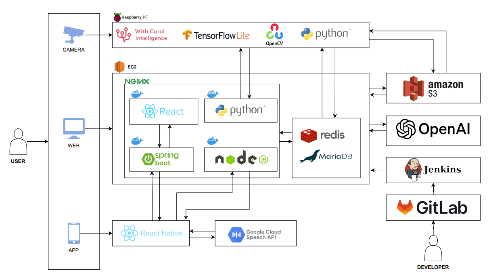

## 서비스화면

### 메인페이지

|                          소행성                          |
| :------------------------------------------------------: |
|  |

### 회원관리

|                     로그인                      |                     회원가입                      |
| :---------------------------------------------: | :-----------------------------------------------: |
|  | 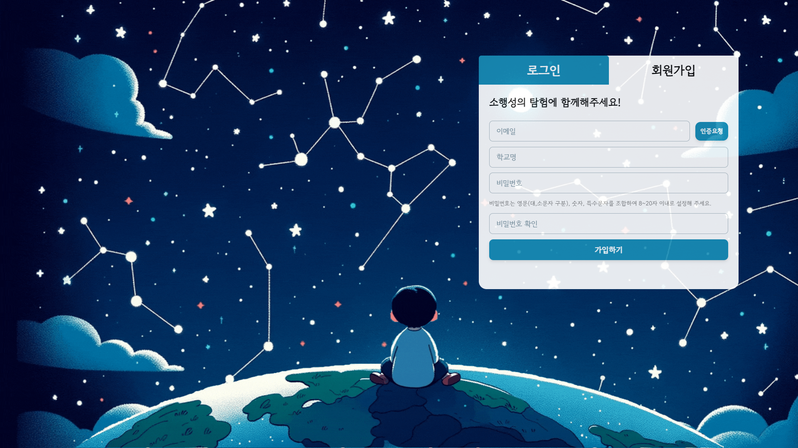 |

### 마이페이지

|                     마이페이지                      |                           회원정보수정                           |                           학생등록                           |
| :-------------------------------------------------: | :--------------------------------------------------------------: | :----------------------------------------------------------: |
| 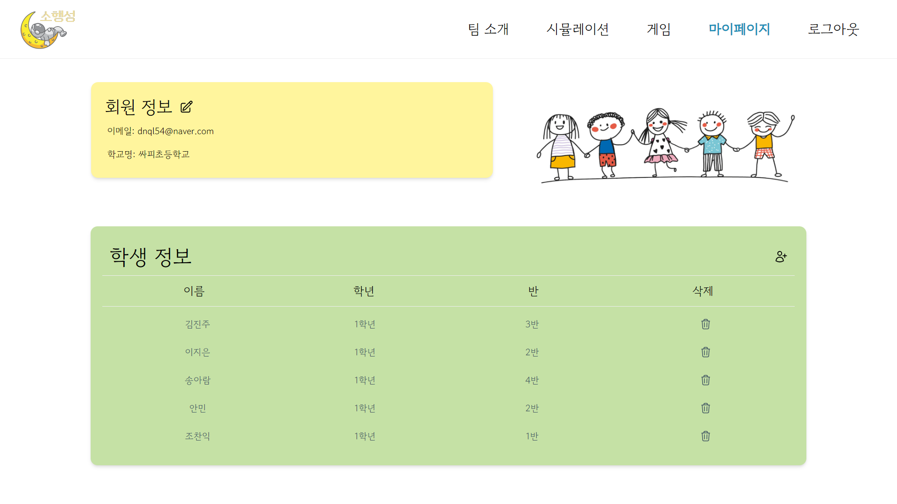 | 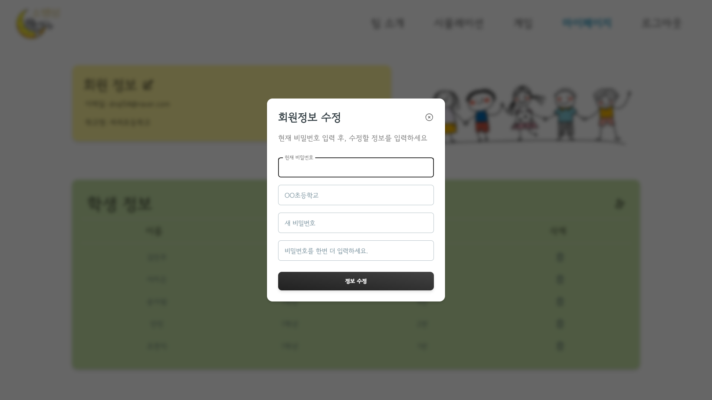 | 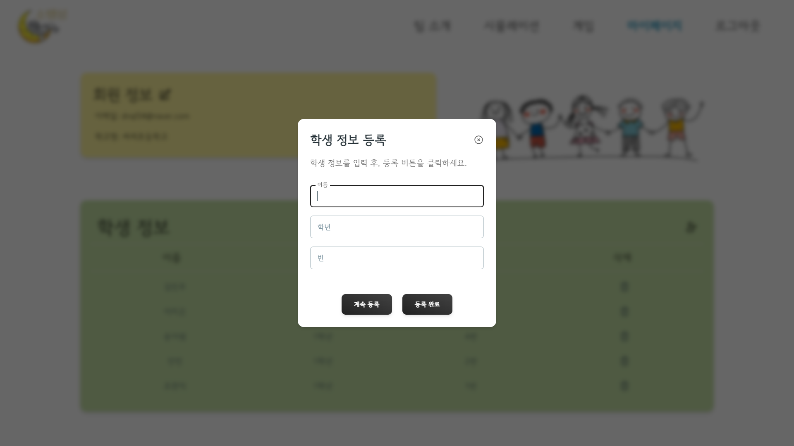 |

### 콘텐츠 목록

|                        시뮬레이션                        |                        게임                        |
| :------------------------------------------------------: | :------------------------------------------------: |
| 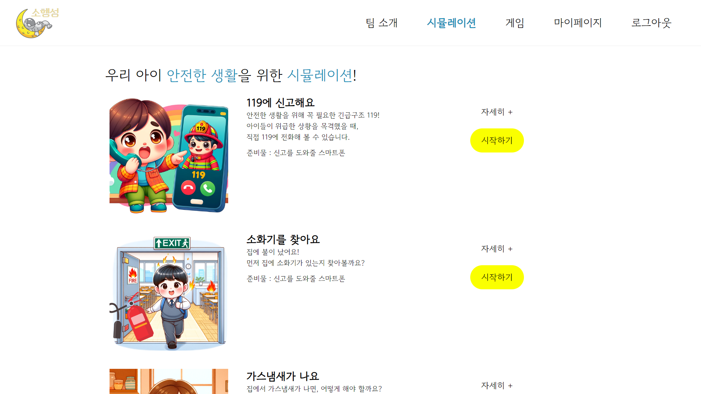 | 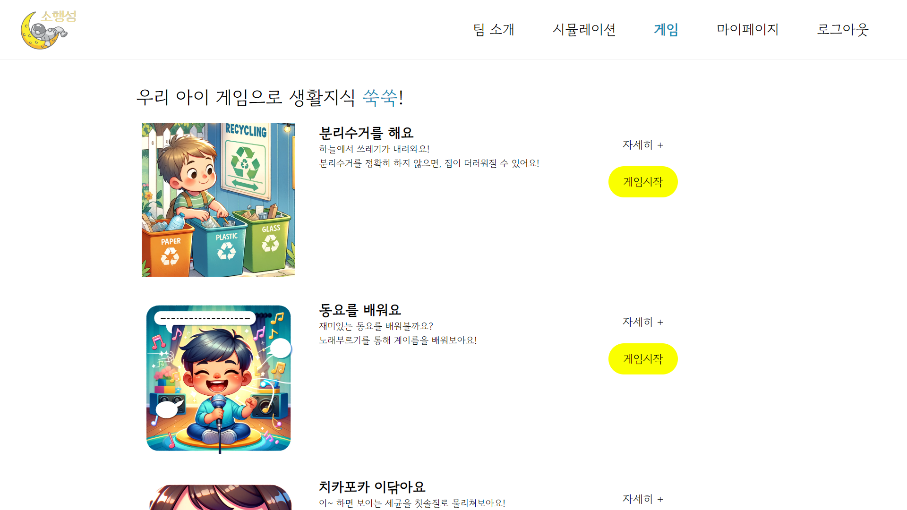 |

### 기기연결 및 연결확인

|                     기기연결 가이드                     |                     OTP                      |                     기기연결 확인                     |
| :-----------------------------------------------------: | :------------------------------------------: | :---------------------------------------------------: |
| 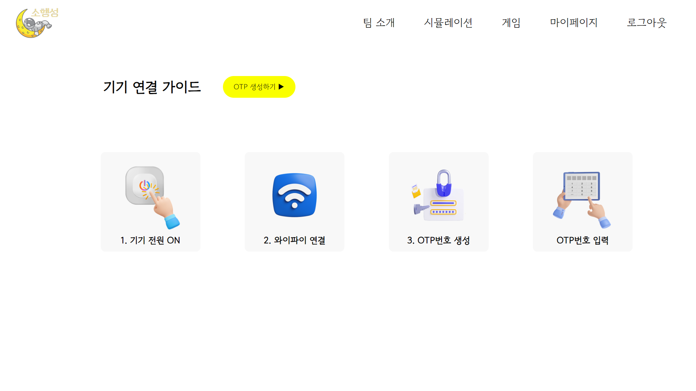 | 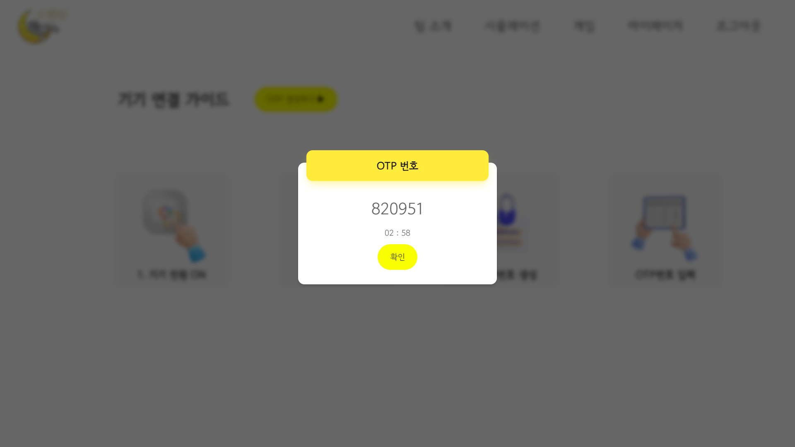 | 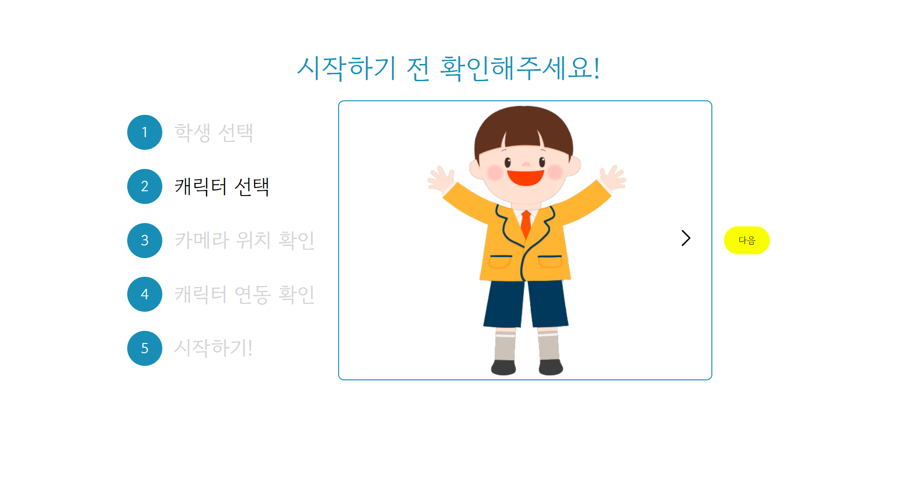 |

<!-- ### 시뮬레이션 디테일 💢

|                     119에 신고해요                      |
| :-----------------------------------------------------: |
|  | -->

<!-- 
 -->

### 시뮬레이션 플레이

|                           인트로                           |                           아웃트로                           |
| :--------------------------------------------------------: | :----------------------------------------------------------: |
|  |  |

|                           지시문                           |                           오답                           |
| :--------------------------------------------------------: | :------------------------------------------------------: |
| 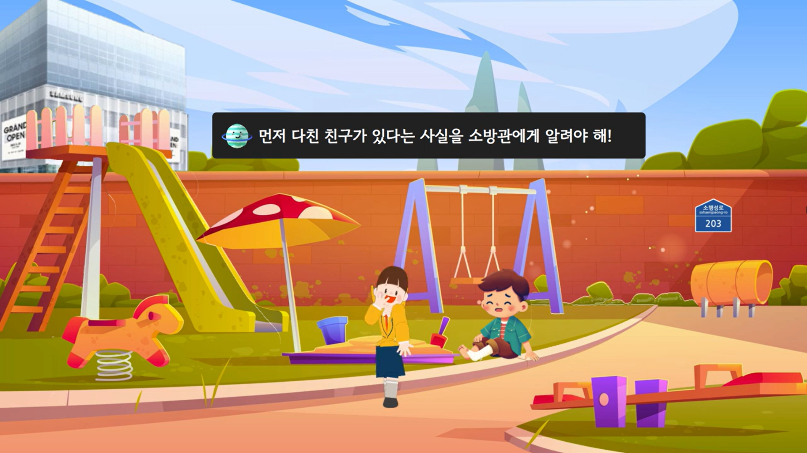 | 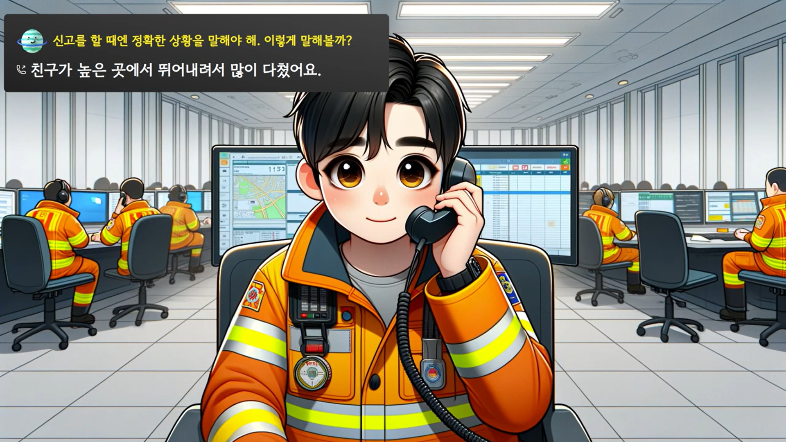 |

|                           소방관                           |                           사용자                           |
| :--------------------------------------------------------: | :--------------------------------------------------------: |
| 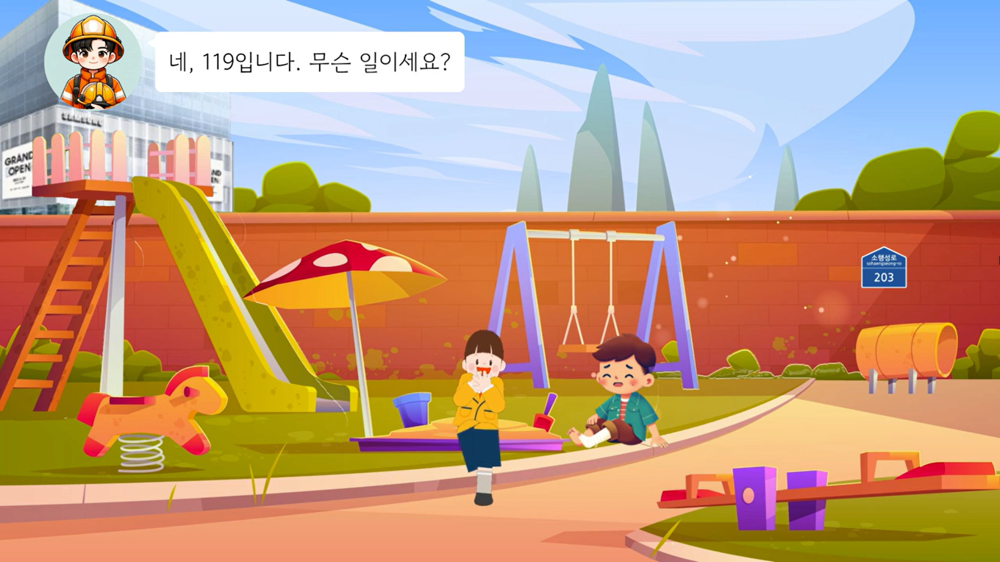 |  |

### APP

|                     로그인                      |                     키패드                      |                     오답                      |
| :---------------------------------------------: | :---------------------------------------------: | :-------------------------------------------: |
| 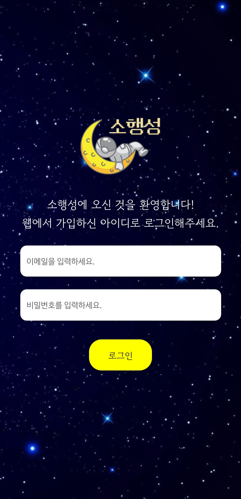 | 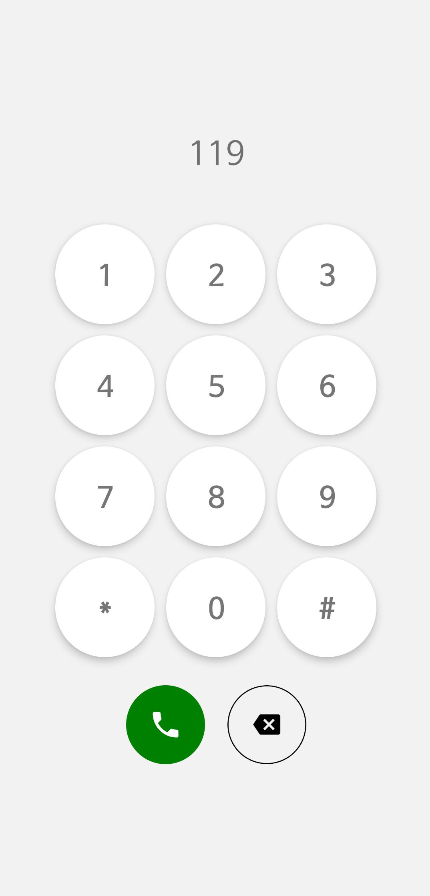 | 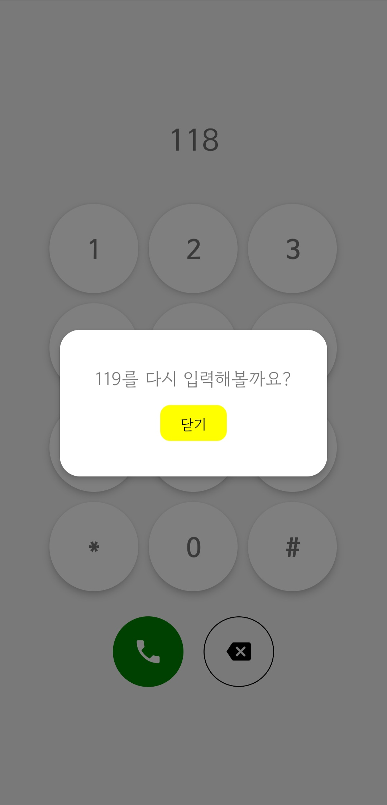 |

|                     메인                      |                     전화중                      |                     로딩                      |
| :-------------------------------------------: | :---------------------------------------------: | :-------------------------------------------: |
| 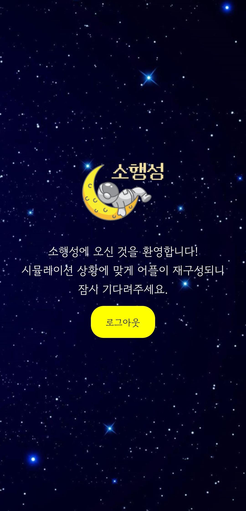 | 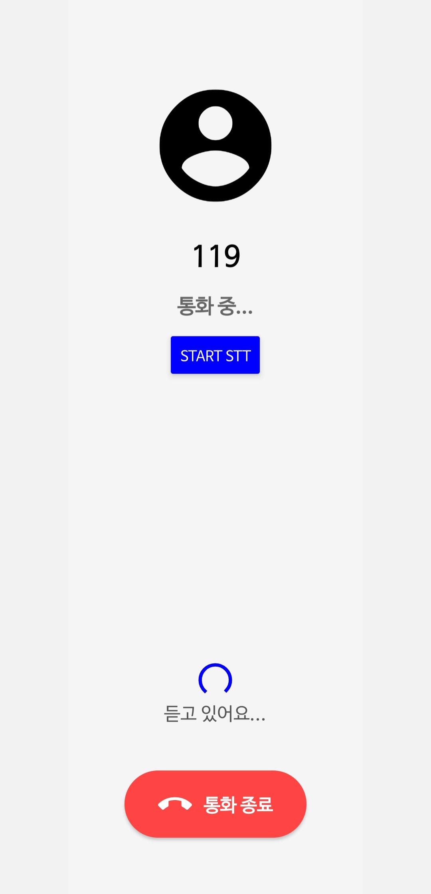 |  |

<!-- ### 팀소개 💢

|                      우리는 소행성                      |
| :-----------------------------------------------------: |
|  | -->

## 산출물

#### [자율PJT*광주\_2반\_C203*발표자료.pptx](./exec/광주_2반_C203_발표자료.pptx) (\*.pptx)

#### [포팅 매뉴얼](./exec/포팅메뉴얼.pdf) (\*.pdf)

#### [소행성 앱](./exec/images/screenshot/APP_QR.jpg) (\*.apk)
